# Development Process — Overview Diagram

> **Note on Diagram Naming Convention:**
> This file contains an inline Mermaid diagram documenting the development process itself.
> For **project-specific diagrams** (PRDs, TDDs), always create **external `.mmd` files** in `docs/`:
> - PRD diagrams: `docs/prd-[feature-name]-figure[N].mmd`
> - TDD diagrams: `docs/tdd-[feature-name]-figure[N].mmd`
> - Reference them in the document with: `See companion diagram: [filename.mmd](filename.mmd)`

```mermaid
flowchart TD
    START([Start]) --> IDEATE

    subgraph IDEATE ["IDEATE — Requirements Gathering"]
        direction TB
        I_CREATE["🆕 CREATE\nGreenfield project"]
        I_EVOLVE["✨ EVOLVE\nBrownfield feature"]
        I_MAINTAIN["🐛 MAINTAIN\nBug fix / tech debt"]
        I_REFACTOR["🔧 REFACTOR\nStructural change"]
    end

    START --> I_CREATE & I_EVOLVE & I_MAINTAIN & I_REFACTOR

    I_CREATE   --> PS["problem-statement.md"]
    I_EVOLVE   --> FP["feature-proposal.md"]
    I_MAINTAIN --> SCOPE{Scope?}
    I_REFACTOR --> RP["refactoring-plan.md\n(one phase at a time)"]

    SCOPE -->|"< 50 lines\nsingle file"| HOTFIX(["Fix directly\n+ regression test"])
    SCOPE -->|"multi-file or\narchitectural"| BA["bug-analysis.md"]

    PS & FP & BA & RP --> PRD

    subgraph PLAN ["Planning Pipeline"]
        direction TB
        PRD["create-prd.md\n― WHAT to build ―\nFunctional requirements\nAcceptance criteria\nNon-goals"]
        TDD["create-tdd.md\n― HOW to build ―\nArchitecture decisions\nSchemas & contracts\nDirectory structure"]
        ISSUES["create-issues.md\n― WHO does what ―\nGitHub Issues\nDependency graph\nAgent-sized tasks"]
        PRD --> TDD --> ISSUES
    end

    ISSUES --> EXECUTE

    subgraph EXECUTE ["execute-issues.md — Parallel Agent Execution"]
        direction LR
        WAVE1["Wave 1\nFoundation issues\n(no dependencies)"]
        WAVE2["Wave 2\nDependent issues\n(unblocked by Wave 1)"]
        WAVEN["Wave N\nFinal issues"]
        WAVE1 --> WAVE2 --> WAVEN
    end

    EXECUTE --> QA

    subgraph QA ["first-run-qa.md — 5-Layer QA Pyramid"]
        direction TB
        BUILD["BUILD\nCompiles · Bundles · Lints"]
        BOOT["BOOT\nApp starts and stays running"]
        RENDER["RENDER\nOutput appears correctly"]
        FUNCTION["FUNCTION\nFeatures work end-to-end"]
        POLISH["POLISH\nEdge cases · Perf · UX"]
        BUILD --> BOOT --> RENDER --> FUNCTION --> POLISH
    end

    HOTFIX --> DONE
    POLISH  --> DONE([" ✅ Shipped "])

    subgraph STD ["Standards Library (always available)"]
        direction TB
        S1["global/coding-style.md"]
        S2["global/error-handling.md"]
        S3["global/conventions.md"]
        S4["backend/api.md"]
        S5["testing/test-writing.md"]
    end

    STD -. "referenced by issues" .-> EXECUTE
    STD -. "referenced in TDD" .-> TDD

    subgraph OBS ["agent-observability.md"]
        MON["Monitor token usage\n(intervene at 140k)"]
    end

    OBS -. "during execution" .-> EXECUTE

    style IDEATE  fill:#dbeafe,stroke:#3b82f6
    style PLAN    fill:#ede9fe,stroke:#7c3aed
    style EXECUTE fill:#dcfce7,stroke:#16a34a
    style QA      fill:#fef9c3,stroke:#ca8a04
    style STD     fill:#f1f5f9,stroke:#94a3b8
    style OBS     fill:#f1f5f9,stroke:#94a3b8
    style HOTFIX  fill:#dcfce7,stroke:#16a34a
    style DONE    fill:#dcfce7,stroke:#16a34a
```



## Improving Flowchart Layout Quality

Mermaid's default layout engine (Dagre) produces mediocre results for complex
flowcharts — crowded nodes, poor edge routing, unnecessary crossings. Two fixes:

### Option 1: Switch to ELK renderer (recommended, one line)

Add this init directive at the top of any `flowchart` or `graph` diagram:

```
%%{init: {"flowchart": {"defaultRenderer": "elk"}}}%%
flowchart TD
    ...
```

ELK (Eclipse Layout Kernel) is bundled with Mermaid v10+ and produces
significantly better layouts. It's marked experimental but is stable in
practice. Works in GitHub rendering, Mermaid Live Editor, and most
Mermaid-aware tools.

### Option 2: Switch to D2 for the diagram

[D2](https://d2lang.com) is a competing diagram-as-code tool with a proprietary
layout engine (TALA) that produces best-in-class results. Syntax is similar in
spirit to Mermaid. Use `.d2` files. TALA requires a separate binary install but
is free for local use.

**Rule of thumb:** sequence diagrams → Mermaid is fine (layout is linear).
Flowcharts/architecture graphs → add `defaultRenderer: elk` first; switch to D2
if ELK still isn't good enough.

---

## Reading the Diagram

| Colour      | Stage                          |
|-------------|-------------------------------|
| Blue        | IDEATE — entry point, 4 paths |
| Purple      | Planning pipeline (PRD/TDD/Issues) |
| Green       | Execution and completion       |
| Yellow      | QA pyramid                     |
| Grey        | Supporting references          |

### Key Decision Points

- **Small bug?** Skip the pipeline — fix directly, add a regression test, done.
- **REFACTOR?** Create the plan, then run the full pipeline **one phase at a time**.
- **Brownfield?** `create-tdd.md` includes a mandatory codebase assessment step before any design decisions.
